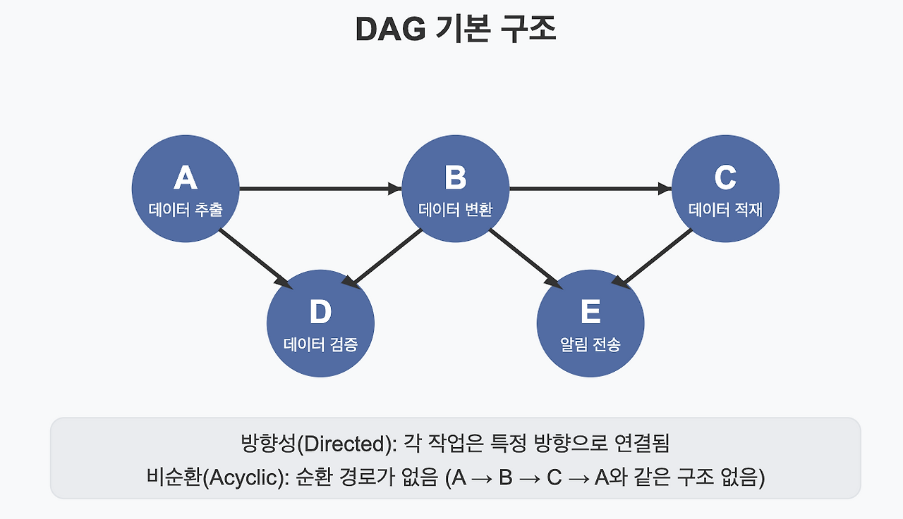
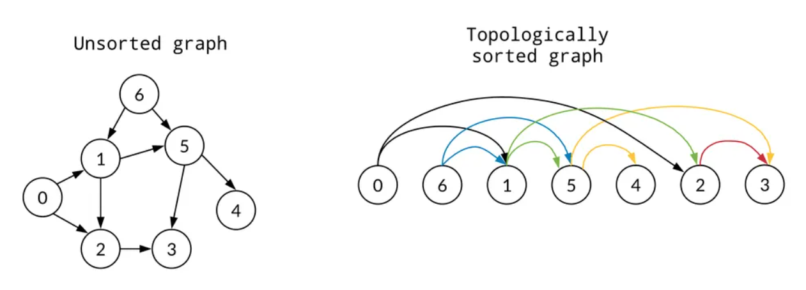

## 1. 프로젝트 목적 및 개요
- python을 통해 GIT 핵심 자료구조인 커밋 그래프와 버전 관리 알고리즘 구현하기
    - DAG그래프, 위상 정렬, 최단 경로 파악, search 알고리즘 구현하기

## 2. 과제 목표 및 학습 내용 (설명) 

### 커밋 그래프와 DAG (방향성 비순환 그래프)
- Git의 커밋은 이전 상태를 가리키는 `parents` 해시를 가짐 
    - 순환 발생 시 부모 자식 관계 파악이 불가함으로 순환이 불가능한 DAG 구조 필요

### DAG 그래프 구조란?

- Dircted : DAG 그래프에서 엣지(선)은 특정 노드에서 다른 노드를 가리키는 방향성을 가진다.
- Acyclic : DAG 그래프는 사이클을 가지지 않는 비순환성을 가진다.
    - 특정 노드에서 엣지를 통해 다시 시작점으로 돌아오지 않음을 의미
    - Loop 미구성 의미
- Graph : 노드(Node)와 엣지(Edge)로 구성된 집합체
    - 노드 : 작업의 단위
    - 엣지 : 작업의 순서 또는 의존성

### 위상 정렬이란?
- 부모 커밋이 자식 커밋보다 항상 먼저 출력되도록 하는 요구사항 확인
- DAG에서 부모부터 출력하기 위해 DFS 위상정렬 알고리즘 사용
- 
    - 모든 노드를 부모, 자식 순서대로 정렬하는 알고리즘
    - 내부적으로 DFS 방식 사용

### 최단 경로 및 조상 탐색 (PATH & ANCESTORS)
- **최단 경로 (PATH):** 양방향 간선으로 간주하는 무방향 그래프로 임시 구축한 뒤 BFS(너비 우선 탐색)를 수행
    - 같은 길이의 최단 경로가 여러 개일 경우 경로 문자열을 커스텀 병합 정렬하여 사전순으로 제일 앞서는 것을 채택
- **조상 탐색 (ANCESTORS):** 부모 방향으로만 뻗어가는 단방향 BFS를 통해 도달 가능한 모든 상위 커밋을 누적하여 출력

### 커스텀 정렬 알고리즘 (Merge Sort)
- 표준 API를 금지하는 제약사항에 따라 병합 정렬(Merge Sort)을 직접 구현
- 비교 조건(Key)을 입력받도록 모듈화하여 `date`와 `author` 기준으로 유연하게 정렬 가능

### 역색인 (Inverted Index)
- 단순 순환 검색(Linear Search)은 $O(N)$의 시간복잡도를 가져 커밋이 많아질수록 성능이 크게 저하
- 이를 막기 위해 커밋이 발생할 때 즉시 단어와 저자를 키(Key)로 삼아 해당 해시들의 집합(Set)을 맵핑하는 `index_keyword`, `index_author` 딕셔너리를 구축

## 3. 실행 방법
```bash
python main.py